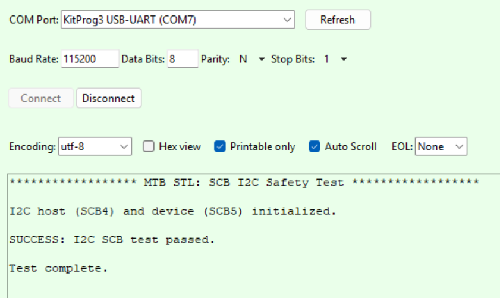

# Safety Test Library (STL) : I2C

This code example demonstrates the usage of ModusToolbox&trade; Safety Test Library (MTB STL) to test the I2C peripheral of the MCU. The example configures one SCB instance as an I2C host and another SCB instance as an I2C device, then verifies communication between the two Serial Communication Blocks (SCBs) using external jumper wires.

Name | Vanity URL
-----|-----------
**Getting started documents** |
ModusToolbox&trade; tools package installation guide| https://www.infineon.com/ModusToolboxInstallguide
ModusToolbox&trade; tools package release notes| https://www.infineon.com/ModusToolboxReleaseNotes
ModusToolbox&trade; tools package quick start guide | https://www.infineon.com/ModusToolboxQSG
ModusToolbox&trade; tools package user guide| https://www.infineon.com/ModusToolboxUserguide
**IDE documents** |
Eclipse IDE for ModusToolbox&trade; user guide | https://www.infineon.com/MTBEclipseIDEUserguide
Visual Studio Code for ModusToolbox&trade; user guide | https://www.infineon.com/MTBVSCodeUserGuide
Arm&reg; Keil&reg; µVision&reg; for ModusToolbox&trade; user guide | https://www.infineon.com/MTBuVisionUserGuide
IAR Embedded Workbench for ModusToolbox&trade; user guide | https://www.infineon.com/MTBIARUserGuide
Configurators and tools |
**General tools** |
ModusToolbox&trade; Dashboard user guide | https://www.infineon.com/ModusToolboxDashboard
ModusToolbox&trade; Project Creator user guide | https://www.infineon.com/ModusToolboxProjectCreator
ModusToolbox&trade; Library Manager user guide | https://www.infineon.com/ModusToolboxLibraryManager
ModusToolbox&trade; BSP Assistant user guide | https://www.infineon.com/ModusToolboxBSPAssistant
ModusToolbox&trade; LCS Manager CLI user guide | https://www.infineon.com/ModusToolboxLCSManager
**BSP configurators** |
ModusToolbox&trade; Device Configurator user guide| https://www.infineon.com/ModusToolboxDeviceConfig
ModusToolbox&trade; CAPSENSE&trade; Configurator user guide | https://www.infineon.com/ModusToolboxCapSenseConfig
ModusToolbox&trade; CAPSENSE&trade; Tuner user guide | https://www.infineon.com/ModusToolboxCapSenseTuner
ModusToolbox&trade; QSPI Configurator user guide | https://www.infineon.com/ModusToolboxQSPIConfig
ModusToolbox&trade; Smart I/O Configurator user guide | https://www.infineon.com/ModusToolboxSmartIOConfig
**Library configurators** |
ModusToolbox&trade; Bluetooth&reg; Configurator user guide | https://www.infineon.com/ModusToolboxBLEConfig
ModusToolbox&trade; EZ-PD&trade; Configurator user guide | https://www.infineon.com/ModusToolboxEZ-PDConfig
ModusToolbox&trade; LIN Configurator user guide | https://www.infineon.com/ModusToolboxLINConfig
ModusToolbox&trade; Secure Policy Configurator user guide | https://www.infineon.com/ModusToolboxSecurePolicyConfig
ModusToolbox&trade; Segment LCD Configurator user guide | https://www.infineon.com/ModusToolboxSegLCDConfig
ModusToolbox&trade; USB Configurator user guide | https://www.infineon.com/ModusToolboxUSBConfig
**MCU tools** |
ModusToolbox&trade; Device Firmware Update Host tool guide | https://www.infineon.com/ModusToolboxDFUHostTool
**Webpage Links** |
ModusToolbox&trade; product page | https://www.infineon.com/ModusToolbox
ModusToolbox&trade; Video Hub | https://www.infineon.com/ModusToolboxVideos
ModusToolbox&trade; Latest Community Announcement Post | https://www.infineon.com/ModusToolboxReleaseAnnouncement

[View this README on GitHub.](https://github.com/Infineon/mtb-example-ce243229-safety-i2c-test)

[Provide feedback on this code example.](https://yourvoice.infineon.com/jfe/form/SV_1NTns53sK2yiljn?Q_EED=eyJVbmlxdWUgRG9jIElkIjoiQ0UyNDMyMjkiLCJTcGVjIE51bWJlciI6IjAwMi00MzIyOSIsIkRvYyBUaXRsZSI6IlNhZmV0eSBUZXN0IExpYnJhcnkgKFNUTCkgOiBJMkMiLCJyaWQiOiJqYWluLmpvc2VwaEBpbmZpbmVvbi5jb20iLCJEb2MgdmVyc2lvbiI6IjEuMC4wIiwiRG9jIExhbmd1YWdlIjoiRW5nbGlzaCIsIkRvYyBEaXZpc2lvbiI6Ik1DRCIsIkRvYyBCVSI6IklDVyIsIkRvYyBGYW1pbHkiOiJQU09DIn0=)

## Requirements

- [ModusToolbox&trade;](https://www.infineon.com/modustoolbox) v3.8 or later (tested with v3.8)
- Programming language: C
- Associated parts:
    1. [XMC5000 MCU](https://www.infineon.com/products/microcontroller/32bit-industrial-arm-cortex-m/xmc5000)

## Supported toolchains (make variable 'TOOLCHAIN')

- GNU Arm&reg; Embedded Compiler 14.2.1 (`GCC_ARM`) – Default value of `TOOLCHAIN`
- Arm&reg; Compiler v6.22 (`ARM`)
- IAR C/C++ Compiler v9.60.1 (`IAR`)

## Supported kits (make variable 'TARGET')

- [XMC5200 Evaluation Kit](https://www.infineon.com/evaluation-board/KIT-XMC52-EVK) (`KIT_XMC52_EVK`)


## Hardware setup

This example enables two I2C SCB instances in the configurable *design.modus* file: SCB4 as a host and SCB5 as a device. Unlike the UART and SPI SCB self-tests, the I2C self-test cannot use a single-block hardware loopback - it requires external jumper wires connecting the host and device SDA/SCL lines.

On `KIT_XMC52_EVK`, the SCB4 host pins (P6.1 SDA, P6.2 SCL) are available directly on header J13 (pins 32 and 33). The SCB5 device pins (P7.1 SDA, P7.2 SCL) are not present on any fixed header - they are only reachable through the pin-selection jumpers J14 and J16, which normally route the Arduino I2C header (J11) SDA/SCL lines to the LIN6 UART pins by default.

**Required jumper and wiring setup:**

1. Move the J16 jumper cap to pins 2-3 (routes SCB5 SDA to J11 pin 2)
2. Move the J14 jumper cap to pins 2-3 (routes SCB5 SCL to J11 pin 1)
3. Connect a wire from J11 pin 1 (SCL) to J13 pin 33 (P6.2)
4. Connect a wire from J11 pin 2 (SDA) to J13 pin 32 (P6.1)

**Table 1. Jumper connections**

 BSP | SCL | SDA
 --------------- | ------ | -----
 KIT_XMC52_EVK | J11 pin 1 to J13 pin 33 (P6.2) | J11 pin 2 to J13 pin 32 (P6.1)

See the kit user guide for the full J13/J11/J14/J16 header layout.

> **Note:** Both the host and device I2C pins are configured with the `CY_GPIO_DM_PULLUP` drive mode in *design.modus*, which uses the MCU's internal resistive pull-up. No external pull-up resistors are required.

## Software setup

See the [ModusToolbox tools package installation guide](https://www.infineon.com/ModusToolboxInstallguide) for information about installing and configuring the tools package.

Install a terminal emulator if you do not have one.

## Using the code example


### Create the project

The ModusToolbox&trade; tools package provides the Project Creator as both a GUI tool and a command line tool.

<details><summary><b>Use Project Creator GUI</b></summary>

1. Open the Project Creator GUI tool

   There are several ways to do this, including launching it from the dashboard or from inside the Eclipse IDE. For more details, see the [Project Creator user guide](https://www.infineon.com/ModusToolboxProjectCreator) (locally available at *{ModusToolbox&trade; install directory}/tools_{version}/project-creator/docs/project-creator.pdf*)

2. On the **Choose Board Support Package (BSP)** page, select a kit supported by this code example. See [Supported kits](#supported-kits-make-variable-target)

   > **Note:** To use this code example for a kit not listed here, you may need to update the source files. If the kit does not have the required resources, the application may not work

3. On the **Select Application** page:

   a. Select the **Applications(s) Root Path** and the **Target IDE**

      > **Note:** Depending on how you open the Project Creator tool, these fields may be pre-selected for you

   b. Select this code example from the list by enabling its check box

      > **Note:** You can narrow the list of displayed examples by typing in the filter box

   c. (Optional) Change the suggested **New Application Name** and **New BSP Name**

   d. Click **Create** to complete the application creation process

</details>


<details><summary><b>Use Project Creator CLI</b></summary>

The 'project-creator-cli' tool can be used to create applications from a CLI terminal or from within batch files or shell scripts. This tool is available in the *{ModusToolbox&trade; install directory}/tools_{version}/project-creator/* directory.

Use a CLI terminal to invoke the 'project-creator-cli' tool. On Windows, use the command-line 'modus-shell' program provided in the ModusToolbox&trade; installation instead of a standard Windows command-line application. This shell provides access to all ModusToolbox&trade; tools. You can access it by typing "modus-shell" in the search box in the Windows menu. In Linux and macOS, you can use any terminal application.

The following example clones the "[I2C test](https://github.com/Infineon/mtb-example-ce243229-safety-i2c-test)" application with the desired name "I2C_Test" configured for the *KIT_XMC52_EVK* BSP into the specified working directory *C:/mtb_projects*:

   ```
   project-creator-cli --board-id KIT_XMC52_EVK --app-id mtb-example-ce243229-safety-i2c-test --user-app-name I2C_Test --target-dir "C:/mtb_projects"
   ```

The 'project-creator-cli' tool has the following arguments:

Argument | Description | Required/optional
---------|-------------|-----------
`--board-id` | Defined in the <id> field of the [BSP](https://github.com/Infineon?q=bsp-manifest&type=&language=&sort=) manifest | Required
`--app-id`   | Defined in the <id> field of the [CE](https://github.com/Infineon?q=ce-manifest&type=&language=&sort=) manifest | Required
`--target-dir`| Specify the directory in which the application is to be created if you prefer not to use the default current working directory | Optional
`--user-app-name`| Specify the name of the application if you prefer to have a name other than the example's default name | Optional

<br>

> **Note:** The project-creator-cli tool uses the `git clone` and `make getlibs` commands to fetch the repository and import the required libraries. For details, see the "Project creator tools" section of the [ModusToolbox&trade; tools package user guide](https://www.infineon.com/ModusToolboxUserGuide) (locally available at {ModusToolbox&trade; install directory}/docs_{version}/mtb_user_guide.pdf).

</details>


### Open the project

After the project has been created, you can open it in your preferred development environment.


<details><summary><b>Eclipse IDE</b></summary>

If you opened the Project Creator tool from the included Eclipse IDE, the project will open in Eclipse automatically.

For more details, see the [Eclipse IDE for ModusToolbox&trade; user guide](https://www.infineon.com/MTBEclipseIDEUserGuide) (locally available at *{ModusToolbox&trade; install directory}/docs_{version}/mt_ide_user_guide.pdf*).

</details>


<details><summary><b>Visual Studio (VS) Code</b></summary>

Launch VS Code manually, and then open the generated *{project-name}.code-workspace* file located in the project directory.

For more details, see the [Visual Studio Code for ModusToolbox&trade; user guide](https://www.infineon.com/MTBVSCodeUserGuide) (locally available at *{ModusToolbox&trade; install directory}/docs_{version}/mt_vscode_user_guide.pdf*).

</details>


<details><summary><b>Arm&reg; Keil&reg; µVision&reg;</b></summary>

Double-click the generated *{project-name}.cprj* file to launch the Keil&reg; µVision&reg; IDE.

For more details, see the [Arm&reg; Keil&reg; µVision&reg; for ModusToolbox&trade; user guide](https://www.infineon.com/MTBuVisionUserGuide) (locally available at *{ModusToolbox&trade; install directory}/docs_{version}/mt_uvision_user_guide.pdf*).

</details>


<details><summary><b>IAR Embedded Workbench</b></summary>

Open IAR Embedded Workbench manually, and create a new project. Then select the generated *{project-name}.ipcf* file located in the project directory.

For more details, see the [IAR Embedded Workbench for ModusToolbox&trade; user guide](https://www.infineon.com/MTBIARUserGuide) (locally available at *{ModusToolbox&trade; install directory}/docs_{version}/mt_iar_user_guide.pdf*).

</details>


<details><summary><b>Command line</b></summary>

If you prefer to use the CLI, open the appropriate terminal, and navigate to the project directory. On Windows, use the command-line 'modus-shell' program; on Linux and macOS, you can use any terminal application. From there, you can run various `make` commands.

For more details, see the [ModusToolbox&trade; tools package user guide](https://www.infineon.com/ModusToolboxUserGuide) (locally available at *{ModusToolbox&trade; install directory}/docs_{version}/mtb_user_guide.pdf*).

</details>


## Operation

1. Ensure the jumper and wiring setup described in [Hardware setup](#hardware-setup) is complete

2. Connect the board to your PC using the provided USB cable through the KitProg3 USB connector

3. Open a terminal program and select the KitProg3 COM port. Set the serial port parameters to 8N1 and 115200 baud

4. Program the board using one of the following:

   <details><summary><b>Using Eclipse IDE</b></summary>

      1. Select the application project in the Project Explorer

      2. In the **Quick Panel**, scroll down, and click **\<Application Name> Program (KitProg3_MiniProg4)**
   </details>


   <details><summary><b>In other IDEs</b></summary>

   Follow the instructions in your preferred IDE

   </details>


   <details><summary><b>Using CLI</b></summary>

     From the terminal, execute the `make program` command to build and program the application using the default toolchain to the default target. The default toolchain is specified in the application's Makefile but you can override this value manually:
      ```
      make program TOOLCHAIN=<toolchain>
      ```

      Example:
      ```
      make program TOOLCHAIN=GCC_ARM
      ```
   </details>

5. After programming, the application starts automatically. Confirm that **MTB STL: SCB I2C Safety Test** is displayed on the UART terminal.

6. The serial terminal should display the result of the test.

   **Figure 1. Terminal output on program startup**

   


## Debugging


You can debug the example to step through the code.


<details><summary><b>In Eclipse IDE</b></summary>

Use the **\<Application Name> Debug (KitProg3_MiniProg4)** configuration in the **Quick Panel**. For details, see the "Program and debug" section in the [Eclipse IDE for ModusToolbox&trade; user guide](https://www.infineon.com/MTBEclipseIDEUserGuide).

</details>


<details><summary><b>In other IDEs</b></summary>

Follow the instructions in your preferred IDE.

</details>


## Design and implementation


This example uses two SCB peripherals on the MCU to perform a self-test of the I2C interface. The design.modus file configures SCB4 as an I2C host (P6.1 SDA, P6.2 SCL) and SCB5 as an I2C device (P7.1 SDA, P7.2 SCL), each with the `CY_GPIO_DM_PULLUP` drive mode enabled on its SDA/SCL pins so the internal resistive pull-up is used and no external pull-up resistors are required.

The example begins by initializing the BSP configuration and setting up retarget-io for debug prints over the dedicated debug UART. The DUT I2C host (SCB4) and device (SCB5) are then initialized, including the NvicMux interrupt routing required on XMC5000 (CAT1C) devices, and the device read/write buffers are configured.

A self-test is then run using the `SelfTest_I2C_SCB()` API from the mtb-stl (https://github.com/Infineon/mtb-stl) safety library. The host writes a byte pattern to the device over the external jumper-wired SDA/SCL lines; the device reads it, computes the 1's complement, and makes it available for the host to read back and verify. Because the function advances the test byte-by-byte on each call and returns `PASS_STILL_TESTING_STATUS` until the full 0x00-0xFF range has been verified, the application loops calling `i2c_self_test()` until a final pass or fail status is returned. The PASS or FAIL result is printed to the debug UART console, and the device halts after a single complete run.

See the Application Notes listed in [Related resources](#related-resources) for more details.

### Resources and settings

**Table 1. Application resources**

 Resource  |  Alias/object     |    Purpose
 :-------- | :-------------    | :------------
 UART (HAL) | DEBUG_UART | UART HAL object used by Retarget-IO for the Debug UART port
 SCB (PDL) | CYBSP_DUT_I2C_MASTER | DUT SCB4 I2C host peripheral under test (P6.1 SDA, P6.2 SCL)
 SCB (PDL) | CYBSP_DUT_I2C_SLAVE | DUT SCB5 I2C device peripheral under test (P7.1 SDA, P7.2 SCL)

<br>

## Related resources

Resources  | Links
-----------|----------------------------------
Application notes  | [AN241720](https://www.infineon.com/assets/row/public/documents/30/42/infineon-getting-started-with-xmc5000-mcu-on-modustoolbox-software-applicationnotes-en.pdf) – Getting started with XMC5000 MCU on ModusToolbox&trade; <br>
Code examples | [Using ModusToolbox&trade;](https://github.com/Infineon/Code-Examples-for-ModusToolbox-Software) on GitHub
Device documentation | [XMC5000 MCU documents](https://www.infineon.com/products/microcontroller/32bit-industrial-arm-cortex-m/xmc5000#Documents) <br>
Development kits | Select your kits from the [Evaluation board finder](https://www.infineon.com/cms/en/design-support/finder-selection-tools/product-finder/evaluation-board).
Libraries on GitHub  | [mtb-pdl-cat1](https://github.com/Infineon/mtb-pdl-cat1) – Peripheral Driver Library (PDL) <br> [mtb-hal-cat1](https://github.com/Infineon/mtb-hal-cat1) – Hardware Abstraction Layer (HAL) Library
Middleware on GitHub | [mcu-middleware](https://github.com/Infineon/modustoolbox-software) – Links to all MCU middleware <br> [mtb-stl](https://github.com/Infineon/mtb-stl) - Safety Test Library (STL)
Tools  | [ModusToolbox&trade;](https://www.infineon.com/modustoolbox) – ModusToolbox&trade; software is a collection of easy-to-use libraries and tools enabling rapid development with Infineon MCUs for applications ranging from wireless and cloud-connected systems, edge AI/ML, embedded sense and control, to wired USB connectivity using PSOC&trade; Industrial/IoT MCUs, AIROC&trade; Wi-Fi and Bluetooth&reg; connectivity devices, XMC&trade; Industrial MCUs, and EZ-USB&trade;/EZ-PD&trade; wired connectivity controllers. ModusToolbox&trade; incorporates a comprehensive set of BSPs, HAL, libraries, configuration tools, and provides support for industry-standard IDEs to fast-track your embedded application development.

<br>

## Other resources


Infineon provides a wealth of data at [www.infineon.com](https://www.infineon.com) to help you select the right device, and quickly and effectively integrate it into your design.


## Document history

Document title: *CE243229* – *Safety Test Library (STL) : I2C Test*

 Version | Description of change
 ------- | ---------------------
 1.0.0   | New code example

<br>

All referenced product or service names and trademarks are the property of their respective owners.

The Bluetooth&reg; word mark and logos are registered trademarks owned by Bluetooth SIG, Inc., and any use of such marks by Infineon is under license.

PSOC&trade;, formerly known as PSoC&trade;, is a trademark of Infineon Technologies. Any references to PSoC&trade; in this document or others shall be deemed to refer to PSOC&trade;.

---------------------------------------------------------

(c) 2026, Infineon Technologies AG, or an affiliate of Infineon Technologies AG. All rights reserved.
This software, associated documentation and materials ("Software") is owned by Infineon Technologies AG or one of its affiliates ("Infineon") and is protected by and subject to worldwide patent protection, worldwide copyright laws, and international treaty provisions. Therefore, you may use this Software only as provided in the license agreement accompanying the software package from which you obtained this Software. If no license agreement applies, then any use, reproduction, modification, translation, or compilation of this Software is prohibited without the express written permission of Infineon.
<br>
Disclaimer: UNLESS OTHERWISE EXPRESSLY AGREED WITH INFINEON, THIS SOFTWARE IS PROVIDED AS-IS, WITH NO WARRANTY OF ANY KIND, EXPRESS OR IMPLIED, INCLUDING, BUT NOT LIMITED TO, ALL WARRANTIES OF NON-INFRINGEMENT OF THIRD-PARTY RIGHTS AND IMPLIED WARRANTIES SUCH AS WARRANTIES OF FITNESS FOR A SPECIFIC USE/PURPOSE OR MERCHANTABILITY. Infineon reserves the right to make changes to the Software without notice. You are responsible for properly designing, programming, and testing the functionality and safety of your intended application of the Software, as well as complying with any legal requirements related to its use. Infineon does not guarantee that the Software will be free from intrusion, data theft or loss, or other breaches ("Security Breaches"), and Infineon shall have no liability arising out of any Security Breaches. Unless otherwise explicitly approved by Infineon, the Software may not be used in any application where a failure of the Product or any consequences of the use thereof can reasonably be expected to result in personal injury.
